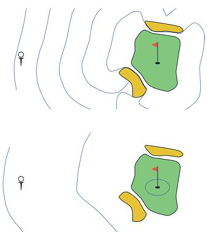

Оптимальные функции ценности для игры в гольф

Рассматривается задача определения оптимальной стратегии ударов в гольфе с использованием двух типов клюшек:

    Драйвер - позволяет послать мяч дальше, но с меньшей точностью  
    Паттер - обеспечивает более точные, но короткие удары

Постановка задачи:

    Определить оптимальную функцию ценности действий q*(s, a), где:
    s - текущее состояние (положение мяча)
    a - выбранное действие (удар драйвером или  паттером)

Анализируются линии уровня функции ценности:

    Линия уровня -1: зона, где можно загнать мяч в лунку одним ударом драйвером (очень близко к лунке)
    Линия уровня -2: зона досягаемости за два удара (первый - драйвером, второй - паттером)
    Линия уровня -3: зона досягаемости за три удара (два удара драйвером и один паттером)

Особенности:

    При ударе драйвером важна не точность попадания в лунку, а вывод мяча в зону, откуда его можно будет точно добить паттером
    Оптимальная стратегия предполагает комбинацию ударов разного типа в зависимости от положения мяча

Книга - SuttonBartoIPRLBook2ndEd.pdf  
https://www.youtube.com/watch?v=U24wlvcxXBg         
